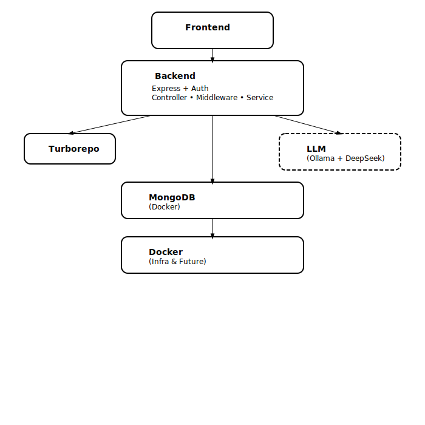

# 🛒 MERN Multi-Vendor E-Commerce Platform

A full-stack, role-based multi-vendor e-commerce platform built with the MERN stack. The current project provides foundational architecture for user, seller, and admin operations, with major UI components scaffolded and awaiting backend integration. A planned DeepSeek-based LLM assistant will enhance the interactive experience.

## 🚀 Features (In Progress)

### ✅ User, Seller & Admin System

- JWT-based authentication with **Refresh Token auto-renewal**
- Role-Based Access Control (RBAC): `user`, `seller`, `admin`
- Auth logic modularized via custom middleware (`auth`, `role`)
- Distinct login systems for admin and sellers

### 🔄 Product & Shop Management

- Product creation, editing, and listing (backend implemented)
- Shop creation for sellers (backend implemented)
- Category service (backend in progress)

### 🧠 AI Chat Assistant (Planned)

- Socket.IO-based chat UI (UI stub in place)
- LLM integration with local **DeepSeek model** via Ollama (planned)
- Seller-side assistant and smart product Q&A

### 🛠️ Engineering Practices

- TypeScript backend with clean modular layering
- Custom decorators and error handling patterns
- TailwindCSS + component-based layout in React
- RTK Query for API integration; separate RTK store for auth

---

## 📂 Tech Stack

| Layer         | Tech Stack                                                   |
|---------------|--------------------------------------------------------------|
| 🧩 Frontend    | React 19 (CRA-based) + RTK + RTK Query + Tailwind CSS        |
| 🖥 Admin Panel | `dashboard/` – React admin panel with modular layout         |
| 🛒 Shopfront   | `frontend/` – completed customer-facing UI (React 19 + CRA) |
| ⚙️ Backend     | Express + TypeScript + Custom Decorators + Yup Validators    |
| 🧠 AI Assistant| DeepSeek LLM (via Ollama) – prompt-based RAG (planned)       |
| 🗄 Database    | MongoDB + Mongoose (Dockerized)                              |
| 🔐 Auth        | JWT (Access + Refresh Tokens) + Role-based Middleware        |
| 📦 Packages    | hooks/, ui/, utils/ – shared via Yarn Workspaces             |
| 🧱 Infra       | Yarn Workspaces + Turborepo + Docker Compose                 |

---

## 📐 Architecture Overview



DeepSeek logo © DeepSeek AI. Licensed under the MIT License. Logo has been trimmed but not otherwise modified.  
Source: [deepseek-ai on GitHub](https://github.com/deepseek-ai)

Express.js & MongoDB icons © [Developer Icons](https://github.com/xandemon/developer-icons).  
Used under open-source terms; all trademarks remain the property of their respective owners.

Other icons provided by [gilbarbara/logos](https://github.com/gilbarbara/logos).  
Licensed under [CC0 1.0 Universal (Public Domain Dedication)](https://creativecommons.org/publicdomain/zero/1.0/).

## 🗂 Project Structure

```
mern-eccomerce-multi-vendor/
mern-ecommerce-multi-vendor/
├── backend/                         # Node.js + Express backend
│   ├── controllers/                # Auth, Token, Product, Category, Shop controllers
│   ├── services/                   # Business logic layer
│   ├── middlewares/               # Auth, Role, Error handling middlewares
│   ├── validators/                # Yup/Zod-based schema validation
│   ├── decorators/, types/, utils/ # Custom decorators, shared types and helpers
│   ├── models/, routes/, errors/, uploads/
│   ├── server.ts                  # Entry point
│   └── package.json, tsconfig.json, .env
├── dashboard/                      # React-based admin panel (app shell)
│   ├── public/
│   └── src/
│       ├── pages/                 # admin/, auth/, general/, seller/ routes
│       ├── components/           # Layout and shared components
│       ├── api/, store/, hooks/, router/, utils/
│       └── App.jsx, index.js, ...
├── frontend/                       # Customer-facing frontend (shop app)
│   ├── public/
│   └── src/
│       ├── pages/, components/, assets/, constants/
│       ├── store/, router/, utils/
│       └── App.jsx, index.js, ...
├── packages/                       # Shared packages managed by Turborepo
│   ├── hooks/                    # Common React hooks (e.g. useDebounce, useAuth)
│   ├── ui/                       # Reusable UI components (built with Tailwind/MUI)
│   └── utils/                    # Shared utility functions
├── docs/                           # Project docs and references (optional)
├── docker-compose.yml              # Docker orchestration for dev environments
├── turbo.json                      # Turborepo task pipeline config
├── tsconfig.base.json              # Base TS config for all packages/apps
├── .gitignore, .env, LICENSE, README.md
├── yarn.lock
└── llm/ (planned)
```

---

## 🔐 Authentication Flow

```
[Login] → Access Token + HttpOnly Refresh Token
[Access API] → Bearer Token via Middleware
[Token Expired] → Silent refresh via RTKQ logic
[RBAC] → `roleMiddleware` enforces route-level access
```

---

## 🤖 LLM Integration Plan

- Local LLM runtime using `deepseek-coder` via `ollama`
- Backend `chat.service.ts` to proxy frontend requests
- Prompt template-based assistant with domain customization
- Chat UI structure already scaffolded in frontend

---

## 🧪 Local Development Setup

```bash
# Install all workspace dependencies
npm install

# Start backend + frontend using Turborepo
npm run dev

# Start MongoDB via Docker Compose (if not already running)
docker compose up -d mongo

# [Planned] Start LLM container
cd llm && ./run-llm.sh
```

---

## 📋 Progress

- ✅ Auth system with refresh token + role-based access (user, seller, admin)
- ✅ Backend services for: authentication, product, shop, category
- ✅ Middleware for RBAC, token verification, error handling
- ✅ Seller dashboard UI scaffolded with layout & navigation
- ✅ Admin dashboard UI structure (sidebar, tables, metrics)
- ✅ Login/register forms for all roles (admin/seller/user)
- ✅ MongoDB managed via Docker Compose
- ✅ Turborepo development environment configured
- 🚧 Product CRUD frontend integration (UI done, API wiring in progress)
- 🚧 Category filter logic (UI components exist, API pending)
- 🚧 Order module (UI stub, backend not implemented)
- 🚧 Chat module via Socket.IO (UI placeholder, backend logic pending)
- 🚧 LLM Assistant (DeepSeek model planned, REST proxy design pending)
- 🚧 Deployment support via Docker Compose (multi-service orchestration)

## ✨ Author

Created by [@GoldenaArcher](https://github.com/GoldenaArcher) to explore scalable full-stack architectures and local LLM integration as preparation for advanced AI-oriented academic research.

### 📋 Engineering Contributions

Originally based on a MERN UI course scaffold, this project was extensively restructured to reflect production-level engineering practices. Key improvements include:

- Migrated backend to TypeScript for stronger type safety
- Replaced Redux Thunk with RTK Query to simplify API state logic
- Implemented secure refresh-token flows and enhanced RBAC enforcement
- Modularized architecture via Turborepo to support multi-role, multi-service development
- Planned and scaffolded integration with DeepSeek LLM (via Ollama) for AI-assisted operations

The result is a maintainable and extensible platform designed to support future features such as real-time chat, advanced admin dashboards, and AI-powered assistant tools.
